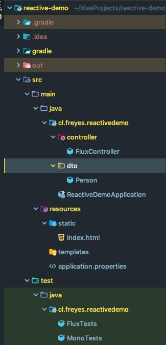

# REACTIVE DEMO

Pequeño proyecto que sirve para ver como funciona la programación reactiva.
- Los set de ejemplos están dentro de la carpeta Test.
- Hay un pequeño ejemplo de uso de streaming con Spring 5 y Spring-boot 2.

## Contenido

### Estructura del Proyecto

- FluxController.java : Pequeño ejemplo de streaming con flux junto a un RestController de spring.
- ReactiveDemoApplication.java : Clase que ejecuta el proyecto con spring-boot.
- test:
    - FluxTests.java : Ejemplos con objetos Flux .
    - MonoTests.java : Ejemplos con objetos Mono.

Por defecto funciona en el puerto 9090
    
 